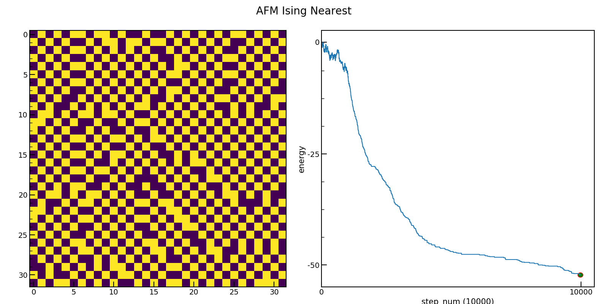

# python関連の細々したもの

## フォルダ説明

### scraping
- 乃木坂のブログから写真をスクレイピングしてくる

- メインファイルは[これ](https://github.com/kokoichi206/python_practice/blob/main/scraping/images.py)

### minesweeper
- マインスイーパーを再現しようとした
- ターミナル上で（のみ）動く

### simulated
- Isingモデルのシミュレーションを行なってみた
- 時間変化は以下。[gif](https://github.com/kokoichi206/python_practice/tree/main/simulated/gif)もある

### books

## その他
### 良いコードを書く方法
- [PEP8](https://pep8-ja.readthedocs.io/ja/latest)
- [リーダブルコード](http://libgen.gs/ads.php?md5=149128e47c5cea6be986bebf001ecc5a)

### 疑問

