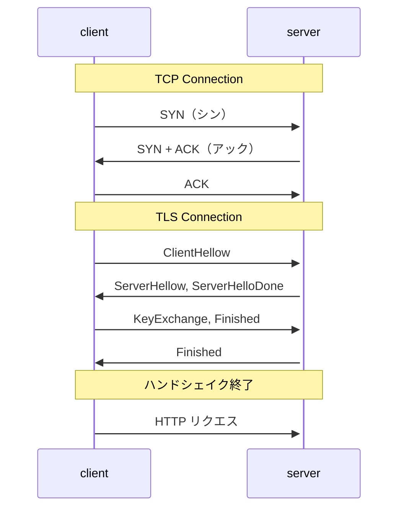

```mermaid
sequenceDiagram
participant 1 as client
participant 2 as server

Note over 1, 2: TCP Connection

1->>+2: SYN（シン）
2->>1: SYN + ACK（アック）
1->>+2: ACK

Note over 1, 2: TLS Connection

1->>+2: ClientHellow
2->>1: ServerHellow, ServerHelloDone
1->>+2: KeyExchange, Finished
2->>1: Finished

Note over 1, 2: ハンドシェイク終了

1->>+2: HTTP リクエス
```
